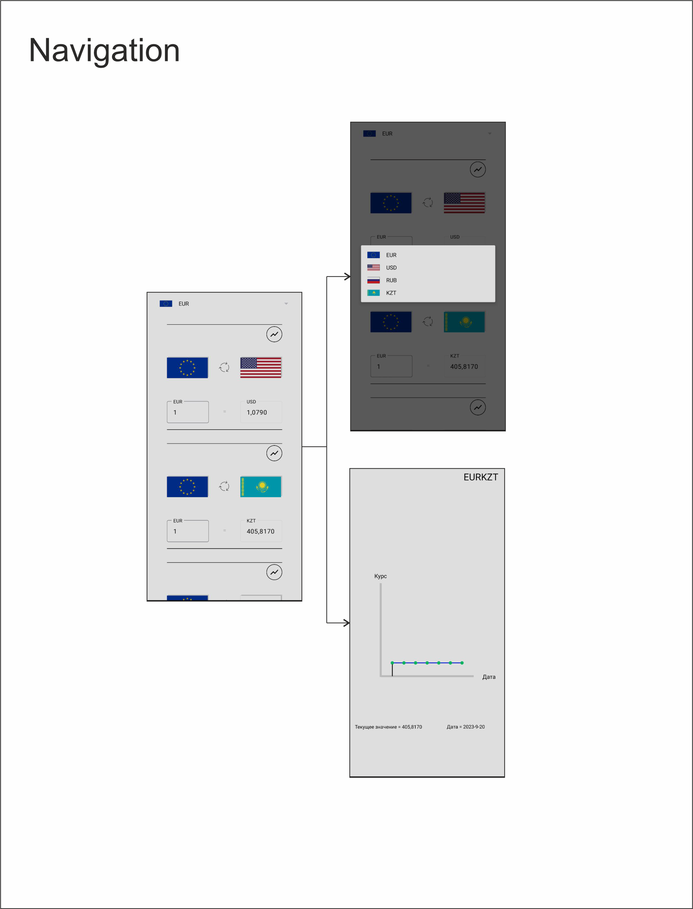

# Currency Converter
## 👋

Hello! This application is designed to search for exchange rates for the Euro, Dollar, Ruble and Tenge. It is possible to view a graph of rate fluctuations of the corresponding currency pair so that it is convenient to view their fluctuations (the graph is configured to display the rate for the current week)
____
## App navigation

The application consists of 2 main screens::
1. Currency conversion screen. It offers currency pairs where you can enter the required amount and convert it to another currency. At the top there is a control for selecting the currency you need, which you can select in the dialog box that opens.
2. Graph screen. A graph of currency pair exchange rate fluctuations for the current week is displayed here. By holding your finger and changing its position on the chart left and right, you can change the cursor, which will point to the day of the week you need.

____
## Instructions for use
In the main screen that opens, select the currency you need in the top control (for example, if you want to convert rubles to another currency, select RUB in the dialog box). Next, in the proposed list, select the currency pair you are interested in and enter the required number that you want to convert to another currency. If you want to make a reverse transfer, simply click on the circle with arrows button to swap currencies. If you need a visual analysis of fluctuations in the exchange rate of a currency pair, click on the chart button, after which a screen will open with fluctuations in the exchange rate for the current week. The chart has a convenient pointer in the form of a black line, which will indicate the day of the week you need. To move it, simply hold your finger on the chart and move it in the direction you want to move the pointer.
_____
## List of technologies
1. Development language: kotlin
2. Design pattern: MVVM + Single Activity
3. DI: Dagger2
4. Navigation: Jetpack Navigation
5. Asynchrony: Coroutine
6. Networking: Retrofit2
7. API Search Currecny: https://currate.ru/#limit

